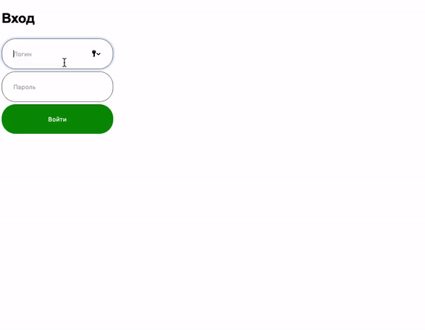

# Авторизация

Домашнее задание к занятию 3.2 «Хранение состояния на клиенте».

## Описание 

Необходимо разработать форму авторизации, через которую пользователь может отправлять данные
 на сервер и получать ответ, а так же хранить данные о залогиневшемся пользователе.



### Исходные данные

1. Основная HTML-разметка
2. Базовая CSS-разметка

Форма авторизации представлена разметкой вида:

```html
<div class="signin" id="signin">
    <h2 class="title">Вход</h2>
    <form action="https://students.netoservices.ru/nestjs-backend/auth" id="signin__form">
        <div class="row">
            <input type="text" name="login" class="control" placeholder="Логин">
        </div>
        <div class="row">
            <input type="password" name="password" class="control" placeholder="Пароль">
        </div>
        <div class="row">
            <button class="btn" id="signin__btn">Войти</button>
        </div>
    </form>
</div>
```

Для отображения формы необходимо задать класс *signin_active*:

```html
<div class="signin signin_active">
    <!-- ... -->
</div>
```

В момент, когда пользователь нажимает на кнопку *#signin__btn*, необходимо
направить AJAX-запрос с содержимым формы по адресу 
*https://students.netoservices.ru/nestjs-backend/auth*

**Важно** Если отправка формы будет реализована неверно, вы можете получить ошибку от сервера.


При неверных данных для входа вы получите JSON-ответ

```json
{
  "success": false
}
```

При успешной авторизации (__логин__ *demo*, __пароль__ *demo*)

```json
{
  "success": true,
  "user_id": 123 
}
```

Блок приветствия пользователя представлен разметкой вида:

```html
<div class="welcome" id="welcome">
    Добро пожаловать, пользователь #<span id="user_id"></span>
</div>
```

Для его показа вам необходимо задать класс *welcome_active*:

```html
<div class="welcome welcome_active">
    <!-- ... -->
</div>
```

### Процесс реализации

1. Реализуйте механизм авторизации. 
Для этого передайте данные формы с помощью POST-запроса по адресу
*https://students.netoservices.ru/nestjs-backend/auth*
    1. После успешного входа, сохраните полученный id-пользователя в локальное хранилище
    2. При успешной авторизации, задайте id пользователя в блок *#welcome* и отобразите его
    3. Если авторизация не удалась, выведите сообщение «Неверный логин/пароль»
2. При загрузке страницы, в случае, если в локальном хранилище имеется 
id пользователя, выведите блок *#welcome* с заданным id пользователя

### Повышенный уровень сложности (не обязательно)

1. Добавьте возможность деавторизации. 
2. После попытки авторизации данные из полей формы необходимо очищать

Для этого вы можете править HTML и CSS по желанию.

## Подсказки (спойлеры)

<details>
<summary>Советы</summary>

Самый простой способ отправить данные для авторизации - воспользоваться FormData

</details>

## Решение задач

1. Перейти в папку задания. `cd ./client-state/auth`.
2. Открыть файл `task.js` в вашем редакторе кода и выполнить задание.
3. Открыть файл `task.html` в вашем браузере и убедиться в правильности выводимых результатов.
4. Добавить файл `task.js` в индекс git с помощью команды `git add %file-path%`, где %file-path% - путь до целевого файла. `git add task.js`.
5. Сделать коммит используя команду `git commit -m '%comment%'`, где %comment% - это произвольный комментарий к вашему коммиту. `git commit -m 'first commit auth'`.
6. Опубликовать код в репозиторий homeworks с помощью команды `git push -u origin master`.
7. Прислать ссылку на репозиторий через личный кабинет на сайте [Нетологии][6].

[0]: https://github.com/
[1]: https://www.sublimetext.com/
[2]: https://code.visualstudio.com/
[3]: https://github.com/netology-code/guides/tree/master/github
[4]: https://git-scm.com/
[5]: https://github.com/netology-code/guides/blob/master/git/REAMDE.md
[6]: https://netology.ru/

*Никаких файлов прикреплять не нужно.*

Все задачи обязательны к выполнению для получения зачета. Присылать на проверку можно каждую задачу по отдельности или все задачи вместе. Во время проверки по частям ваша домашняя работа будет со статусом "На доработке".

Любые вопросы по решению задач задавайте в чате учебной группы.
