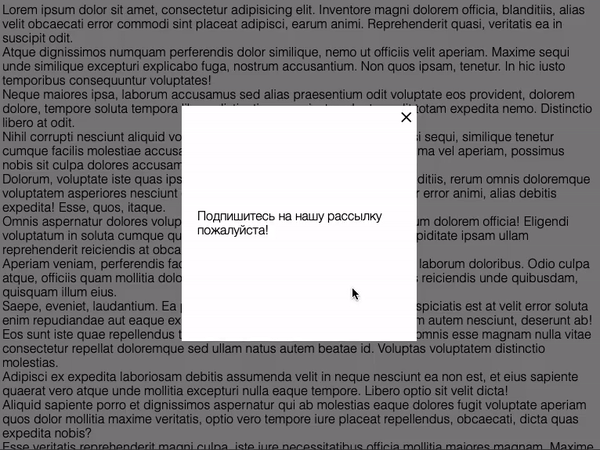

# Всплывающее окно

Домашнее задание к занятию 3.2 «Хранение состояния на клиенте».

## Описание 

Необходимо реализовать всплывающее окно, которое появляется только один раз. 
То есть, только после закрытия этого окна (а не просто обновления страницы), 
оно больше никогда не покажется.



[Ранее](../../element-search/popups) вы уже выполняли работу со всплывающими окнами, это домашнее задание
использует похожие стили и разметку. Вы можете взять за основу ваш прошлый код.

### Исходные данные

1. Основная HTML-разметка
2. Базовая CSS-разметка

Базовая разметка окна представлена в виде:

```html
<div class="modal" id="subscribe-modal">
    <div class="modal__content">
        <div class="modal__close modal__close_times">&times;</div>
        Подпишитесь на нашу рассылку пожалуйста!
    </div>
</div>
```

При нажатии на элемент с классом *modal__close* необходимо закрыть окно.
Закрыть окно - значит удалить у него класс *modal_active*.

Открытое окно имеет следующую разметку:

```html
<div class="modal modal_active" id="subscribe-modal">
    <!-- ... -->
</div>
```

### Процесс реализации

1. После закрытия окна, установите в cookie-файле информацию о закрытии окна
2. Если после перезагрузки в cookie нет информации о закрытии, необходимо 
окно показать.
3. Если страница была перезагружена с показанным окном, в cookie-файл не нужно
ничего вносить

## Решение задач

1. Перейти в папку задания. `cd ./client-state/popup`.
2. Открыть файл `task.js` в вашем редакторе кода и выполнить задание.
3. Открыть файл `task.html` в вашем браузере и убедиться в правильности выводимых результатов.
4. Добавить файл `task.js` в индекс git с помощью команды `git add %file-path%`, где %file-path% - путь до целевого файла. `git add task.js`.
5. Сделать коммит используя команду `git commit -m '%comment%'`, где %comment% - это произвольный комментарий к вашему коммиту. `git commit -m 'first commit popup'`.
6. Опубликовать код в репозиторий homeworks с помощью команды `git push -u origin master`.
7. Прислать ссылку на репозиторий через личный кабинет на сайте [Нетологии][6].

[0]: https://github.com/
[1]: https://www.sublimetext.com/
[2]: https://code.visualstudio.com/
[3]: https://github.com/netology-code/guides/tree/master/github
[4]: https://git-scm.com/
[5]: https://github.com/netology-code/guides/blob/master/git/REAMDE.md
[6]: https://netology.ru/

*Никаких файлов прикреплять не нужно.*

Все задачи обязательны к выполнению для получения зачета. Присылать на проверку можно каждую задачу по отдельности или все задачи вместе. Во время проверки по частям ваша домашняя работа будет со статусом "На доработке".

Любые вопросы по решению задач задавайте в чате учебной группы.
