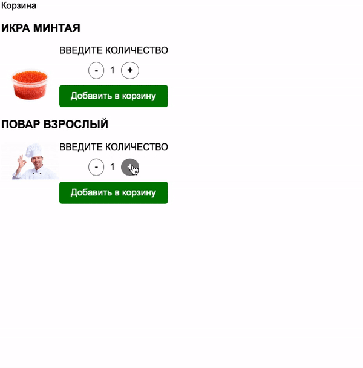
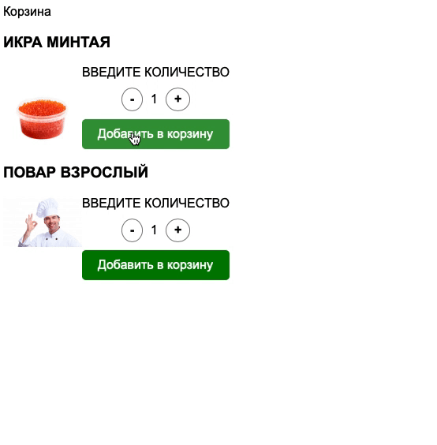

# Корзина товаров

Домашнее задание к занятию 2.3 «Изменение структуры HTML-документа».

## Описание 

Необходимо написать механизм добавления товаров в корзину.



### Исходные данные

1. Основная HTML-разметка
2. Базовая CSS-разметка

Карточка товара представляет разметку вида:

```html
<div class="product" data-id="1">
    <!-- ... -->
</div>
```

Содержимое атрибута *data-id* - уникальный идентификатор товара (артикул).

Управление количеством товара представлено следующей разметкой:

```html
<div class="product__quantity-controls">
    <div class="product__quantity-control product__quantity-control_dec">
        -
    </div>
    <div class="product__quantity-value">
        1
    </div>
    <div class="product__quantity-control product__quantity-control_inc">
        +
    </div>
</div>
```

Нажимая на элементы с классом *product__quantity-control* 
необходимо уменьшить или увеличить
значение в элементе с классом *product__quantity-value*

Товар в корзине представляется следующей разметкой:

```html
<div class="cart__product" data-id="1">
    
    <div class="cart__product-count">20</div>
</div>
```

При добавлении товара в корзину:

1. Копируется его артикул и изображение
2. Количество товаров добавляется или увеличивается в соответствии с 
выбранным значением (которое находится в *.product__quantity-value*)

Иными словами: 

1. Элемент с классом *cart__product* имеет атрибут *data-id*. Его значение берётся
из атрибута *data-id* (артикула товара) карточки товара (элемент с классом *product*)
2. В элементе с классом *cart__product-image*, атрибут *src* cодержит изображение
товара (содержимое *src* элемента с классом *product__image*)

### Процесс реализации

1. При нажатии на кнопки увеличения/уменьшения количества товаров, число
должно также меняться. Минимальное число товаров - 1
(отрицательные значения не допускаются)
2. Реализуйте добавление товара в корзину с заданным количеством.
3. Если товар уже имеется в корзине, количество необходимо увеличить, 
не добавляя в корзину новый элемент.

### Повышенный уровень сложности #1 (не обязательно)

1. Сделайте удаление товаров из корзины
2. Показывайте корзину (и заголовок) только если в корзине есть хотя бы один товар

При необходимости, вы можете дописывать самостоятельно CSS или HTML-код.

### Повышенный уровень сложности #2 (не обязательно)

Сделайте эффект перемещения товара в корзину по такому принципу:


Принцип основан на создании копии изображения, которая за равные промежутки времени
перемещается из одной части экрана в другую. Используйте абсолютное позиционирование
и свойства *left/top*.

При необходимости, вы можете дописывать самостоятельно CSS или HTML-код.

### Повышенный уровень сложности #3 (не обязательно)

Сделайте сохранение списка добавленных в корзину товаров даже после
обновления страницы.

В будущих лекциях мы будем касаться локального хранилища (localStorage).
Для решения этой задачи, вам потребуется познакомиться с темой уже сейчас.

Материалы для изучения:

1. [Window.localStorage](https://developer.mozilla.org/ru/docs/Web/API/Window/localStorage)
2. [LocalStorage на пальцах](https://tproger.ru/articles/localstorage/)

## Подсказки (спойлеры)

<details>
<summary>Используемые темы</summary>

1. Метод *getBoundingClientRect* (повышенный уровень сложности)
2. Работа с объектом *dataset*

</details>

<details>
<summary>Советы</summary>

При реализации анимации, вам необходимо:

1. Получить у изображения-продукта его координаты через *getBoundingClientRect*
2. Получить у изображения в корзине его координаты через *getBoundingClientRect*
3. Высчитать разницу между двумя изображениями по оси X и по оси Y
4. Задать количество шагов, за которое одно изображение «настигнет другое»
5. С помощью *setTimeout/setInterval* в течение заданного количества шагов
постоянно уменьшать разницу между двумя картинками
6. По окончанию анимации удалить изображение-копию 

</details>

## Решение задач

1. Перейти в папку задания. `cd ./document-structure/cart`.
2. Открыть файл `task.js` в вашем редакторе кода и выполнить задание.
3. Открыть файл `task.html` в вашем браузере и убедиться в правильности выводимых результатов.
4. Добавить файл `task.js` в индекс git с помощью команды `git add %file-path%`, где %file-path% - путь до целевого файла. `git add task.js`.
5. Сделать коммит используя команду `git commit -m '%comment%'`, где %comment% - это произвольный комментарий к вашему коммиту. `git commit -m 'first commit cart'`.
6. Опубликовать код в репозиторий homeworks с помощью команды `git push -u origin master`.
7. Прислать ссылку на репозиторий через личный кабинет на сайте [Нетологии][6].

[0]: https://github.com/
[1]: https://www.sublimetext.com/
[2]: https://code.visualstudio.com/
[3]: https://github.com/netology-code/guides/tree/master/github
[4]: https://git-scm.com/
[5]: https://github.com/netology-code/guides/blob/master/git/REAMDE.md
[6]: https://netology.ru/

*Никаких файлов прикреплять не нужно.*

Все задачи обязательны к выполнению для получения зачета. Присылать на проверку можно каждую задачу по отдельности или все задачи вместе. Во время проверки по частям ваша домашняя работа будет со статусом "На доработке".

Любые вопросы по решению задач задавайте в чате учебной группы.
