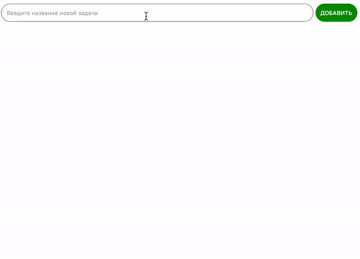
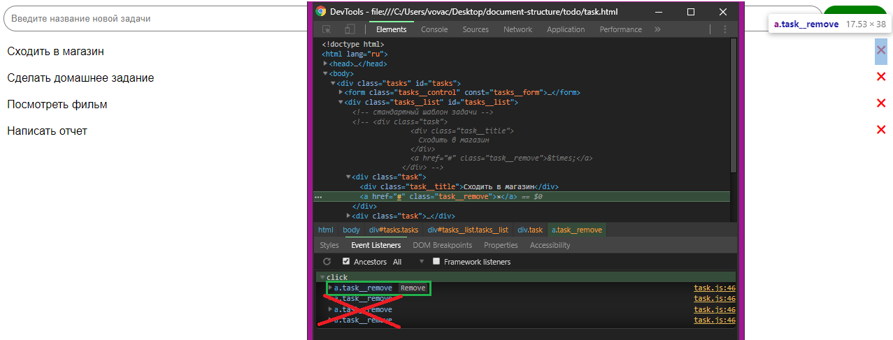

# Простой список дел

Домашнее задание к занятию 2.3 «Изменение структуры HTML-документа».

## Описание 

Необходимо написать простой планировщик дел. В данной версии все дела
теряются после обновления страницы



### Исходные данные

1. Основная HTML-разметка
2. Базовая CSS-разметка

Шаблон новой задачи выглядит так:

```html
<div class="task">
  <div class="task__title">
    Сходить в магазин
  </div>
  <a href="#" class="task__remove">&times;</a>
</div>
```

При нажатии на элемент с классом *task__remove*, задача должна удаляться

### Процесс реализации

1. Реализуйте добавление задач по нажатию клавиши Enter при наличии текста
в поле ввода
2. Реализуйте механизм удаления задач
3. Важный момент: в задании для кнопок удаления задач для каждой кнопки должен быть только **один** обработчик события. Тоесть не должно быть более одного обработчика. Для этого добавляйте слушатель события **только** на добавляемый элемент.


### Повышенный уровень сложности (не обязательно)

Сделайте сохранение задач даже после перезагрузки страницы.

В будущих лекциях мы будем касаться локального хранилища (localStorage).
Для решения этой задачи, вам потребуется познакомиться с темой уже сейчас.

Материалы для изучения:

1. [Window.localStorage](https://developer.mozilla.org/ru/docs/Web/API/Window/localStorage)
2. [LocalStorage на пальцах](https://tproger.ru/articles/localstorage/)

## Решение задач
1. Перейти в папку задания. `cd ./document-structure/todo`.
2. Открыть файл `task.js` в вашем редакторе кода и выполнить задание.
3. Открыть файл `task.html` в вашем браузере и убедиться в правильности выводимых результатов.
4. Добавить файл `task.js` в индекс git с помощью команды `git add %file-path%`, где %file-path% - путь до целевого файла. `git add task.js`.
5. Сделать коммит используя команду `git commit -m '%comment%'`, где %comment% - это произвольный комментарий к вашему коммиту. `git commit -m 'first commit todo'`.
6. Опубликовать код в репозиторий homeworks с помощью команды `git push -u origin master`.
7. Прислать ссылку на репозиторий через личный кабинет на сайте [Нетологии][6].

[0]: https://github.com/
[1]: https://www.sublimetext.com/
[2]: https://code.visualstudio.com/
[3]: https://github.com/netology-code/guides/tree/master/github
[4]: https://git-scm.com/
[5]: https://github.com/netology-code/guides/blob/master/git/REAMDE.md
[6]: https://netology.ru/

*Никаких файлов прикреплять не нужно.*

Все задачи обязательны к выполнению для получения зачета. Присылать на проверку можно каждую задачу по отдельности или все задачи вместе. Во время проверки по частям ваша домашняя работа будет со статусом "На доработке".

Любые вопросы по решению задач задавайте в чате учебной группы.
