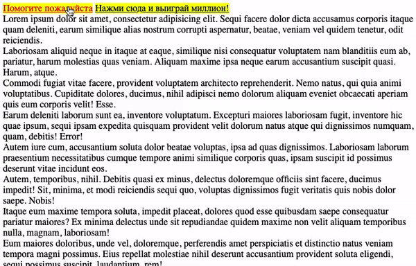

# Всплывающая подсказка

Домашнее задание к занятию 2.3 «Изменение структуры HTML-документа».

## Описание 

Необходимо написать всплывающую подсказку для элементов. Подсказка появляется
после клика на элементе.



### Исходные данные

1. Основная HTML-разметка
2. Базовая CSS-разметка

Базовая разметка элемента, который нуждается в подсказке:

```html
<a href="" class="has-tooltip" title="Что бы вы хотели?">Помогите пожалуйста</a>
```

Шаблон подсказки выглядит так:

```html
<div class="tooltip">Текст подсказки</div>
```

Данные для текста подсказки берутся из атрибута *title*

Подсказки активируются классом *tooltip_active*


### Процесс реализации

1. Реализуйте появление подсказки на основе положения текста
2. Показывайте подсказку при клике на элемент.

### Повышенный уровень сложности #1 (не обязательно)

В один момент времени должна показываться только одна подсказка

### Повышенный уровень сложности #2 (не обязательно)

Добавьте подсказке дополнительный атрибут data-position для настройки места появления
подсказки:

1. top - над текстом
2. left - слева от текста
3. right - справа от текста
4. bottom - снизу от текста 

## Решение задач
1. Перейти в папку задания. `cd ./document-structure/tooltip`.
2. Открыть файл `task.js` в вашем редакторе кода и выполнить задание.
3. Открыть файл `task.html` в вашем браузере и убедиться в правильности выводимых результатов.
4. Добавить файл `task.js` в индекс git с помощью команды `git add %file-path%`, где %file-path% - путь до целевого файла. `git add task.js`.
5. Сделать коммит используя команду `git commit -m '%comment%'`, где %comment% - это произвольный комментарий к вашему коммиту. `git commit -m 'first commit tooltip'`.
6. Опубликовать код в репозиторий homeworks с помощью команды `git push -u origin master`.
7. Прислать ссылку на репозиторий через личный кабинет на сайте [Нетологии][6].

[0]: https://github.com/
[1]: https://www.sublimetext.com/
[2]: https://code.visualstudio.com/
[3]: https://github.com/netology-code/guides/tree/master/github
[4]: https://git-scm.com/
[5]: https://github.com/netology-code/guides/blob/master/git/REAMDE.md
[6]: https://netology.ru/

*Никаких файлов прикреплять не нужно.*

Все задачи обязательны к выполнению для получения зачета. Присылать на проверку можно каждую задачу по отдельности или все задачи вместе. Во время проверки по частям ваша домашняя работа будет со статусом "На доработке".

Любые вопросы по решению задач задавайте в чате учебной группы.
