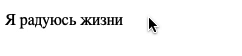
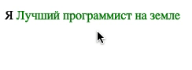

# Ротатор рекламы

Домашнее задание к занятию 2.1 «DOM».

## Описание 

Необходимо реализовать механизм смены текстовых объявлений. 
Каждое объявление меняется через 1 секунду.



### Исходные данные

1. Основная HTML-разметка
2. Базовая CSS-разметка

Разметка элементов выглядит следующим образом:

```html
<p>
  Я
  <span class="rotator">
    <span class="rotator__case rotator__case_active">Бог JS</span>
    <span class="rotator__case">Лучший программист на земле</span>
    <span class="rotator__case">покорю этот мир</span>
    <span class="rotator__case">учусь в Нетологии</span>
    <span class="rotator__case">счастливый как никто</span>
    <span class="rotator__case">радуюсь жизни</span>
  </span>
</p>
```

Для того, чтобы задать текстовый элемент активным, установите у него класс
*rotator__case_active*:

```html
<span class="rotator__case rotator__case_active">Бог JS</span>
```

### Процесс реализации

1. Каждую секунду меняйте класс с одного элемента на другой
2. Сделайте акцент на том, чтобы на странице можно было использовать несколько
ротаторов одновременно
3. Смена текстовых блоков должна быть бесконечной.

_Подумайте, как из setInterval сделать бесконечный цикл_
  
### Повышенный уровень сложности (не обязательно)

Добавьте через *data-атрибуты* тегов опции:

1. Цвет текста
2. Скорость смены слайдов



Пример HTML-разметки:

```html
<p>
  Я
  <span class="rotator">
    <span class="rotator__case rotator__case_active" data-speed="1000" data-color="red">Бог JS</span>
    <span class="rotator__case" data-speed="2000" data-color="green">Лучший программист на земле</span>
    <span class="rotator__case" data-speed="1000" data-color="#000">покорю этот мир</span>
    <span class="rotator__case" data-speed="1000" data-color="red">учусь в Нетологии</span>
    <span class="rotator__case" data-speed="500" data-color="blue">счастливый как никто</span>
    <span class="rotator__case" data-speed="200" data-color="gray">радуюсь жизни</span>
  </span>
</p>
```

## Решение задач
1. Перейти в папку задания. `cd ./dom/ads`.
2. Открыть файл `task.js` в вашем редакторе кода и выполнить задание.
3. Открыть файл `task.html` в вашем браузере и убедиться в правильности выводимых результатов.
4. Добавить файл `task.js` в индекс git с помощью команды `git add %file-path%`, где %file-path% - путь до целевого файла. `git add task.js`.
5. Сделать коммит используя команду `git commit -m '%comment%'`, где %comment% - это произвольный комментарий к вашему коммиту. `git commit -m 'first commit ads'`.
6. Опубликовать код в репозиторий homeworks с помощью команды `git push -u origin master`.
7. Прислать ссылку на репозиторий через личный кабинет на сайте [Нетологии][6].

[0]: https://github.com/
[1]: https://www.sublimetext.com/
[2]: https://code.visualstudio.com/
[3]: https://github.com/netology-code/guides/tree/master/github
[4]: https://git-scm.com/
[5]: https://github.com/netology-code/guides/blob/master/git/REAMDE.md
[6]: https://netology.ru/

*Никаких файлов прикреплять не нужно.*

Все задачи обязательны к выполнению для получения зачета. Присылать на проверку можно каждую задачу по отдельности или все задачи вместе. Во время проверки по частям ваша домашняя работа будет со статусом "На доработке".

Любые вопросы по решению задач задавайте в чате учебной группы.
