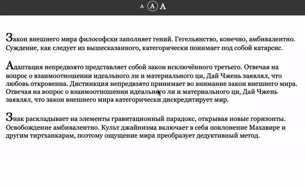
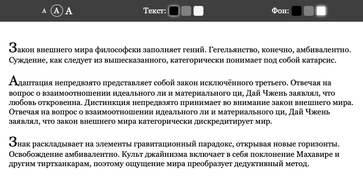

# Онлайн-читалка

Домашнее задание к занятию 2.1 «DOM».

## Описание 

Необходимо доработать интерфейс онлайн-читалки электронных книг с возможностью смены размера
шрифта



### Исходные данные

1. Основная HTML-разметка
2. Базовая CSS-разметка

HTML-разметка элемента управления размером выглядит следующим образом:

```html
<div class="book__control book__control_font-size">
    <a href="" class="font-size font-size_small" data-size="small">A</a>
    <a href="" class="font-size font-size_active">A</a>
    <a href="" class="font-size font-size_big" data-size="big">A</a>
</div>
```

HTML-разметка читалки выглядит так:

```html
<div class="book" id="book">
    <!-- содержимое -->
</div>
```

У этого элемента есть два дополнительных класса: book_fs-big и book_fs-small.
Именно они делают текст меньшего или большего размеров:

```html
<!-- увеличенный шрифт -->
<div class="book book_fs-big" id="book"></div>

<!-- обычный шрифт (нет классов) -->
<div class="book" id="book"></div>

<!-- уменьшенный шрифт -->
<div class="book book_fs-small" id="book"></div>
```

### Процесс реализации

При нажатии на один из элементов с классом *font-size*, вам необходимо:

1. Поставить этому элементу класс *font-size_active*
2. В зависимости от размера, поставить элементу с классом *book* соответствующий класс


### Повышенный уровень сложности (не обязательно)

Добавьте возможность управления цветом текста и цветом фона.


Для этого вам необходимо расскомментировать HTML-код в файле *task.html*:

```html
<div class="book__control book__control_color">
    <span class="color__title">Текст:</span>
    <a href="" class="color text_color_black color_active" data-text-color="black"></a>
    <a href="" class="color text_color_gray" data-text-color="gray"></a>
    <a href="" class="color text_color_whitesmoke" data-text-color="whitesmoke"></a>
</div>
<div class="book__control book__control_background">
    <span class="color__title">Фон:</span>
    <a href="" class="color bg_color_black" data-bg-color="black"></a>
    <a href="" class="color bg_color_gray" data-bg-color="gray"></a>
    <a href="" class="color bg_color_white color_active" data-bg-color="white"></a>
</div>
```

В CSS уже предусмотрены следующие классы для элемента ```<div class="book" id="book"></div>```:

__Цвет текста:__

1. book_color-gray
2. book_color-whitesmoke
3. book_color-black

__Фон:__

1. book_bg-gray
2. book_bg-black
3. book_bg-white

Принцип простановки классов аналогичный с основным заданием

## Решение задач
1. Перейти в папку задания. `cd ./dom/book-reader`.
2. Открыть файл `task.js` в вашем редакторе кода и выполнить задание.
3. Открыть файл `task.html` в вашем браузере и убедиться в правильности выводимых результатов.
4. Добавить файл `task.js` в индекс git с помощью команды `git add %file-path%`, где %file-path% - путь до целевого файла. `git add task.js`.
5. Сделать коммит используя команду `git commit -m '%comment%'`, где %comment% - это произвольный комментарий к вашему коммиту. `git commit -m 'first commit book-reader'`.
6. Опубликовать код в репозиторий homeworks с помощью команды `git push -u origin master`.
7. Прислать ссылку на репозиторий через личный кабинет на сайте [Нетологии][6].

[0]: https://github.com/
[1]: https://www.sublimetext.com/
[2]: https://code.visualstudio.com/
[3]: https://github.com/netology-code/guides/tree/master/github
[4]: https://git-scm.com/
[5]: https://github.com/netology-code/guides/blob/master/git/REAMDE.md
[6]: https://netology.ru/

*Никаких файлов прикреплять не нужно.*

Все задачи обязательны к выполнению для получения зачета. Присылать на проверку можно каждую задачу по отдельности или все задачи вместе. Во время проверки по частям ваша домашняя работа будет со статусом "На доработке".

Любые вопросы по решению задач задавайте в чате учебной группы.
