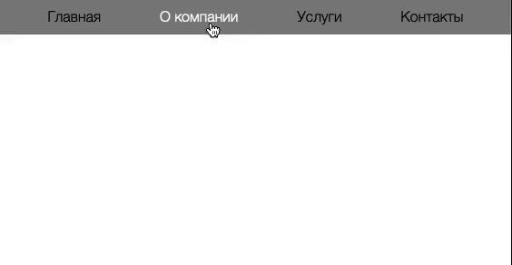
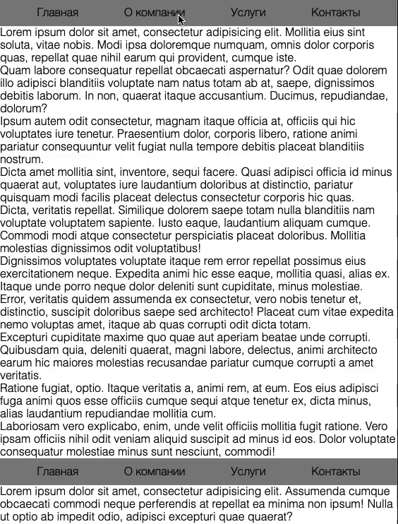

# Навигационное меню

Домашнее задание к занятию 1.2 «Способы поиска нужного HTML-элемента».

## Описание 

Необходимо реализовать двухуровневое навигационное меню. 
При клике на пункт должны открываться подразделы 



### Исходные данные

1. Основная HTML-разметка
2. Базовые CSS-стили

Пункты меню представлены кодом:

```html
<li class="menu__item">
    <a href="https://netology.ru/" class="menu__link">Главная</a>
</li>
```

Те, которые имеют вложенное меню:

```html
<li class="menu__item">
    <a href="" class="menu__link">О компании</a>
    <ul class="menu menu_sub">
        <li class="menu__item">
            <a href="https://netology.ru/clients" class="menu__link">Клиенты</a>
        </li>
        <li class="menu__item">
            <a href="https://netology.ru/service" class="menu__link">Обслуживание</a>
        </li>
        <li class="menu__item">
            <a href="https://netology.ru/wearecool" class="menu__link">Награды</a>
        </li>
    </ul>
</li>
```

Для показа вложенного меню, вам необходимо поставить класс *menu_active* вот так:

```html
<ul class="menu menu_sub menu_active">
    <!-- ... -->
</ul>

```

### Процесс реализации

1. Зарегистрируйте обработчики события *click* на элементах с классом *menu__link*
2. Найдите меню рядом со ссылкой. Если оно есть, переключите у него класс *menu_active*
3. Запрещайте переход по ссылке для тех, что имеют вложенное меню. Остальные
пункты меню должны без помех переводить пользователя на соответствующие страницы.

### Повышенный уровень сложности (не обязательно)

1. Одновременно не должно быть открыто более одного вложенного меню. Все остальные 
должны быть скрыты
2. Напишите код для случая, когда на странице может быть более 1 навигационного меню.




## Решение задач
1. Перейти в папку задания. `cd ./element-search/menu`.
2. Открыть файл `task.js` в вашем редакторе кода и выполнить задание.
3. Открыть файл `task.html` в вашем браузере и убедиться в правильности выводимых результатов.
4. Добавить файл `task.js` в индекс git с помощью команды `git add %file-path%`, где %file-path% - путь до целевого файла. `git add task.js`.
5. Сделать коммит используя команду `git commit -m '%comment%'`, где %comment% - это произвольный комментарий к вашему коммиту. `git commit -m 'first commit menu'`.
6. Опубликовать код в репозиторий homeworks с помощью команды `git push -u homeworks master`.
7. Прислать ссылку на репозиторий через личный кабинет на сайте [Нетологии][6].

[0]: https://github.com/
[1]: https://www.sublimetext.com/
[2]: https://code.visualstudio.com/
[3]: https://github.com/netology-code/guides/tree/master/github
[4]: https://git-scm.com/
[5]: https://github.com/netology-code/guides/blob/master/git/REAMDE.md
[6]: https://netology.ru/

*Никаких файлов прикреплять не нужно.*

Все задачи обязательны к выполнению для получения зачета. Присылать на проверку можно каждую задачу по отдельности или все задачи вместе. Во время проверки по частям ваша домашняя работа будет со статусом "На доработке".

Любые вопросы по решению задач задавайте в группе на Facebook.
