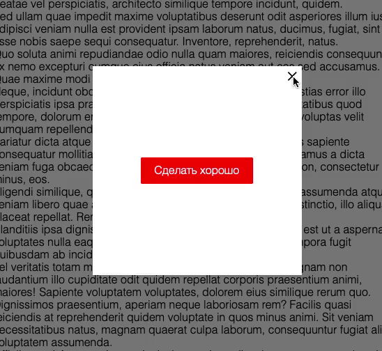

# Всплывающие окна

Домашнее задание к занятию 1.2 «Способы поиска нужного HTML-элемента».

## Описание 

Необходимо реализовать возможность открытия и закрытия всплывающих окон по условию.



### Исходные данные

1. Основная HTML-разметка
2. Базовые CSS-стили

Разметка окон представлена следующим кодом:

```html
<div class="modal" id="modal_main">
  <div class="modal__content">
    <div class="modal__close modal__close_times">&times;</div>
    <a href="#" class="btn btn_danger modal__close show-success">Сделать хорошо</a>
  </div>
</div>
```

Для того, чтобы окно было активно (показывалось на странице), добавьте ему класс
*modal_active*:

```html
<div class="modal modal_active">
    <!-- ... -->
</div>
```

Элементы с классом *modal__close* предназначены для закрытия активного окна.

### Процесс реализации

1. В момент запуска скрипта, покажите окно *#modal_main*
2. Сделайте закрытие активного окна по нажатию на его элемент с классом *modal__close*
3. По нажатию на элемент с классом *show-success* покажите окно *#modal_success*

## Решение задач
1. Перейти в папку задания. `cd ./element-search/popups`.
2. Открыть файл `task.js` в вашем редакторе кода и выполнить задание.
3. Открыть файл `task.html` в вашем браузере и убедиться в правильности выводимых результатов.
4. Добавить файл `task.js` в индекс git с помощью команды `git add %file-path%`, где %file-path% - путь до целевого файла. `git add task.js`.
5. Сделать коммит используя команду `git commit -m '%comment%'`, где %comment% - это произвольный комментарий к вашему коммиту. `git commit -m 'first commit popups'`.
6. Опубликовать код в репозиторий homeworks с помощью команды `git push -u homeworks master`.
7. Прислать ссылку на репозиторий через личный кабинет на сайте [Нетологии][6].


## Подсказки (спойлеры)

<details>
<summary>Используемые темы</summary>

1. Событие *click*, метод *onclick*, обработчик события
2. Метод Array.from() или оператор распространения (spread, «...») для удобной
   навигации по найденным элементам
   
</details>
</summary>

[0]: https://github.com/
[1]: https://www.sublimetext.com/
[2]: https://code.visualstudio.com/
[3]: https://github.com/netology-code/guides/tree/master/github
[4]: https://git-scm.com/
[5]: https://github.com/netology-code/guides/blob/master/git/REAMDE.md
[6]: https://netology.ru/

*Никаких файлов прикреплять не нужно.*

Все задачи обязательны к выполнению для получения зачета. Присылать на проверку можно каждую задачу по отдельности или все задачи вместе. Во время проверки по частям ваша домашняя работа будет со статусом "На доработке".

Любые вопросы по решению задач задавайте в группе на Facebook.
