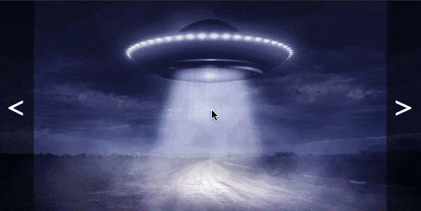
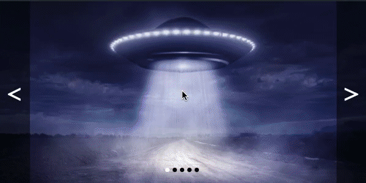

# Слайдер

Домашнее задание к занятию 1.2 «Способы поиска нужного HTML-элемента».

## Описание 

Необходимо реализовать слайдер изображений с бесконечной сменой слайдов.



### Исходные данные

1. Основная HTML-разметка
2. Базовые CSS-стили

Все слайды представлены следующей структурой:

```html
<div class="slider__item">
  
</div>
```

Для того, чтобы конкретный слайд был активен, у него должен быть класс
*slider__item_active*:

```html
<div class="slider__item slider__item_active">
    <!-- ... -->
</div>
```

Навигация с помощью боковых кнопок представлена разметкой:

```html
<div class="slider__arrows">
  <div class="slider__arrow slider__arrow_prev">&lt;</div>
  <div class="slider__arrow slider__arrow_next">&gt;</div>
</div>
```

### Процесс реализации

1. Установите обработчики события *click* на элементах «Влево» и «Вправо»
2. При смене слайдов учитывайте, что навигация должна быть бесконечной. То есть, 
смена крайнего левого слайда должна перекидывать к крайнему правому и наоборот.

### Повышенный уровень сложности (не обязательно)

Добавьте к слайдеру управление с помощью точек: 



Вся HTML/CSS разметка уже присутствует в файлах:

```html
<div class="slider__dots">
  <div class="slider_dot"></div>
  <div class="slider_dot"></div>
  <div class="slider_dot"></div>
  <div class="slider_dot"></div>
  <div class="slider_dot"></div>
</div>
```

При нажатии на каждый из элементов с классом *slider_dot* необходимо
переходить на соответствующий слайд.

Для того, чтобы сделать точку активной, необходимо задать ей класс
*slider__dot_active*:

```html
<div class="slider__dot slider__dot_active"></div>
```

Навигация с помощью боковых элементов должна также приводить к смене активных точек

## Решение задач
1. Перейти в папку задания. `cd ./element-search/slider`.
2. Открыть файл `task.js` в вашем редакторе кода и выполнить задание.
3. Открыть файл `task.html` в вашем браузере и убедиться в правильности выводимых результатов.
4. Добавить файл `task.js` в индекс git с помощью команды `git add %file-path%`, где %file-path% - путь до целевого файла. `git add task.js`.
5. Сделать коммит используя команду `git commit -m '%comment%'`, где %comment% - это произвольный комментарий к вашему коммиту. `git commit -m 'first commit slider'`.
6. Опубликовать код в репозиторий homeworks с помощью команды `git push -u homeworks master`.
7. Прислать ссылку на репозиторий через личный кабинет на сайте [Нетологии][6].

[0]: https://github.com/
[1]: https://www.sublimetext.com/
[2]: https://code.visualstudio.com/
[3]: https://github.com/netology-code/guides/tree/master/github
[4]: https://git-scm.com/
[5]: https://github.com/netology-code/guides/blob/master/git/REAMDE.md
[6]: https://netology.ru/

*Никаких файлов прикреплять не нужно.*

Все задачи обязательны к выполнению для получения зачета. Присылать на проверку можно каждую задачу по отдельности или все задачи вместе. Во время проверки по частям ваша домашняя работа будет со статусом "На доработке".

Любые вопросы по решению задач задавайте в группе на Facebook.
