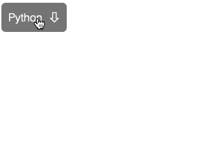

# Выпадающие списки

Домашнее задание к занятию 1.3 «Объект события».

## Описание 

Необходимо создать управление кнопкой с прикреплённым к ней выпадающим списком



### Исходные данные

1. Основная HTML-разметка
2. Базовая CSS-разметка

Базовая разметка кнопки представлена следующим кодом:

```html
<div class="dropdown">
    <div class="dropdown__value">JavaScript</div>
    <ul class="dropdown__list">
        <li class="dropdown__item">
            <a href="" class="dropdown__link">
                JavaScript
            </a>
        </li>
        <li class="dropdown__item">
            <a href="" class="dropdown__link">
                PHP
            </a>
        </li>
        <li class="dropdown__item">
            <a href="" class="dropdown__link">
                Python
            </a>
        </li>
        <li class="dropdown__item">
            <a href="" class="dropdown__link">
                Fortran
            </a>
        </li>
    </ul>
</div>
```

В элементе с классом *dropdown__value* содержится выбранное значение.

Для того, чтобы открыть меню, требуется проставить класс *dropdown__list_active*:

```html
<ul class="dropdown__list dropdown__list_active"></ul>
```

Нажатие на элемент с классом *dropdown__item* при открытом списке должно:
1. Закрывать список
2. Устанавливать новое значение в элемент с классом *dropdown__value*

### Процесс реализации

1. Сделайте сворачивание/разворачивание списка по нажатию на кнопку
2. Сделайте замену значения по выбору соответствующего пункта меню
3. Предусмотрите случай, когда на странице может одновременно находиться несколько
таких кнопок
4. Не забывайте запрещать переход по ссылке 

## Подсказки (спойлеры)

<details>
<summary>Используемые темы</summary>

1. Событие *click*, метод *addEventListener*, обработчик события
2. Свойство *textContent*
3. Метод Array.from() или оператор распространения (spread, «...») для удобной
   навигации по найденным элементам
4. Метод *closest*
   
</details>


## Решение задач
1. Перейти в папку задания. `cd ./event-object/dropdown`.
2. Открыть файл `task.js` в вашем редакторе кода и выполнить задание.
3. Открыть файл `task.html` в вашем браузере и убедиться в правильности выводимых результатов.
4. Добавить файл `task.js` в индекс git с помощью команды `git add %file-path%`, где %file-path% - путь до целевого файла. `git add task.js`.
5. Сделать коммит используя команду `git commit -m '%comment%'`, где %comment% - это произвольный комментарий к вашему коммиту. `git commit -m 'first commit dropdown'`.
6. Опубликовать код в репозиторий homeworks с помощью команды `git push -u origin master`.
7. Прислать ссылку на репозиторий через личный кабинет на сайте [Нетологии][6].

[0]: https://github.com/
[1]: https://www.sublimetext.com/
[2]: https://code.visualstudio.com/
[3]: https://github.com/netology-code/guides/tree/master/github
[4]: https://git-scm.com/
[5]: https://github.com/netology-code/guides/blob/master/git/REAMDE.md
[6]: https://netology.ru/

*Никаких файлов прикреплять не нужно.*

Все задачи обязательны к выполнению для получения зачета. Присылать на проверку можно каждую задачу по отдельности или все задачи вместе. Во время проверки по частям ваша домашняя работа будет со статусом "На доработке".

Любые вопросы по решению задач задавайте в чате учебной группы.
