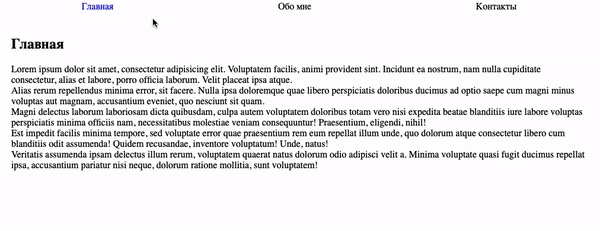

# Управление вкладками

Домашнее задание к занятию 1.3 «Объект события».

## Описание 

Необходимо реализовать механизм переключения вкладок



### Исходные данные

1. Основная HTML-разметка
2. Базовая CSS-разметка

HTML-разметка делится на 2 части:

1. Сами вкладки, элементы с классом *tab*
2. Содержимое вкладки, элементы с классом *tab__content*

```html
<div class="tab__navigation">
    <div class="tab tab_active">
        Главная
    </div>
    <div class="tab">
        Обо мне
    </div>
    <div class="tab">
        Контакты
    </div>
</div>
<div class="tab__contents">
    <div class="tab__content tab__content_active">
        <!-- Текст вкладки «Главная» -->
    </div>
    <div class="tab__content">
        <!-- Текст вкладки «Обо мне» -->
    </div>
    <div class="tab__content">
        <!-- Текст вкладки «Контакты» -->
    </div>
</div>
```

Для того, чтобы вкладка была выбранной, у элемента с классом *tab* должен быть класс
*tab_active*:

```html
<div class="tab tab_active">
    Главная
</div>
```

Для того, чтобы показывалось верное содержимое, у элемента с классом *tab__content*
должен быть класс *tab__content_active*:

```html
<div class="tab__content tab__content_active">
    <!-- Текст вкладки «Главная» -->
</div>
```

При переключении вкладки, нужно поставить эти два активных класса соответствующим
элементам.

## Подсказки (спойлеры)

<details>
<summary>Советы</summary>

Для удобного нахождения индекса вкладки, можно использовать метод
indexOf в найденном массиве вкладок *.tab*. Найденный индекс можно использовать
для показа нужного содержимого *.tab__content*

</details>

### Процесс реализации

1. Зарегистрируйте обработчики событий на переключателях вкладок
2. Сделайте акцент на том, что таких механизмов переключения может быть несколько
на странице

## Решение задач
1. Перейти в папку задания. `cd ./event-object/tabs`.
2. Открыть файл `task.js` в вашем редакторе кода и выполнить задание.
3. Открыть файл `task.html` в вашем браузере и убедиться в правильности выводимых результатов.
4. Добавить файл `task.js` в индекс git с помощью команды `git add %file-path%`, где %file-path% - путь до целевого файла. `git add task.js`.
5. Сделать коммит используя команду `git commit -m '%comment%'`, где %comment% - это произвольный комментарий к вашему коммиту. `git commit -m 'first commit tabs'`.
6. Опубликовать код в репозиторий homeworks с помощью команды `git push -u origin master`.
7. Прислать ссылку на репозиторий через личный кабинет на сайте [Нетологии][6].

[0]: https://github.com/
[1]: https://www.sublimetext.com/
[2]: https://code.visualstudio.com/
[3]: https://github.com/netology-code/guides/tree/master/github
[4]: https://git-scm.com/
[5]: https://github.com/netology-code/guides/blob/master/git/REAMDE.md
[6]: https://netology.ru/

*Никаких файлов прикреплять не нужно.*

Все задачи обязательны к выполнению для получения зачета. Присылать на проверку можно каждую задачу по отдельности или все задачи вместе. Во время проверки по частям ваша домашняя работа будет со статусом "На доработке".

Любые вопросы по решению задач задавайте в чате учебной группы.
