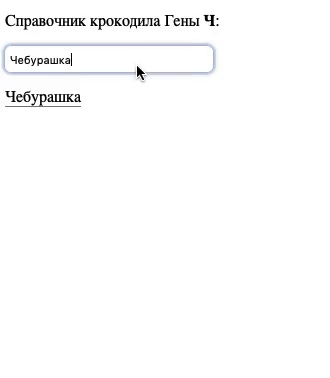

# Выпадающий список с поиском

Домашнее задание к занятию 2.2 «Работа с HTML-формами».

## Описание 

Необходимо __дописать__ удобное управление списком интересов для профиля пользователя.



### Исходные данные

1. Основная HTML-разметка
2. Базовая CSS-разметка
3. Часть написанного кода JS

Реализация представляет собой HTML-обёртку над тегом *select*:

В существующей реализации необходимо доработать метод *getMatches*

```javascript
  getMatches( text ) {
    /*
      TODO: этот метод нужно дописать
      text - фраза, которую вводят в поле поиска
      Метод должен вернуть массив.

      Он формируется на основе списка опций select-элемента (this.input)
      Подходящие опции - те, чей текст содержит то, что есть в аргументе text
      Необходимо вернуть массив объектов со свойствами:
      {
        text: 'Содержимое <option>',
        value: 'Содержимое атрибута value'
      }
    */
    return [
      {
        text: 'Чубакка',
        value: '1'
      }
    ];
  }
```

В экземпляре класса *Autocomplete* имеется свойство *input*, которое указывет
на тег *select*. Его необходимо использовать для обхода по всем опциям списка.

## Подсказки (спойлеры)

<details>
<summary>Используемые темы</summary>

1. Свойство *options* тега *select*
2. Метод [*includes*](https://developer.mozilla.org/ru/docs/Web/JavaScript/Reference/Global_Objects/String/includes)

</details>

<details>
<summary>Советы</summary>

Для получения всех опций тега *select* достаточно обратиться к *this.input.options*

</details>


### Процесс реализации

1. Допишите метод *getMatches*
2. Получайте удовольствие :) 

## Решение задач
1. Перейти в папку задания. `cd ./html-forms/autocomplete`.
2. Открыть файл `task.js` в вашем редакторе кода и выполнить задание.
3. Открыть файл `task.html` в вашем браузере и убедиться в правильности выводимых результатов.
4. Добавить файл `task.js` в индекс git с помощью команды `git add %file-path%`, где %file-path% - путь до целевого файла. `git add task.js`.
5. Сделать коммит используя команду `git commit -m '%comment%'`, где %comment% - это произвольный комментарий к вашему коммиту. `git commit -m 'first commit autocomplete'`.
6. Опубликовать код в репозиторий homeworks с помощью команды `git push -u origin master`.
7. Прислать ссылку на репозиторий через личный кабинет на сайте [Нетологии][6].

[0]: https://github.com/
[1]: https://www.sublimetext.com/
[2]: https://code.visualstudio.com/
[3]: https://github.com/netology-code/guides/tree/master/github
[4]: https://git-scm.com/
[5]: https://github.com/netology-code/guides/blob/master/git/REAMDE.md
[6]: https://netology.ru/

*Никаких файлов прикреплять не нужно.*

Все задачи обязательны к выполнению для получения зачета. Присылать на проверку можно каждую задачу по отдельности или все задачи вместе. Во время проверки по частям ваша домашняя работа будет со статусом "На доработке".

Любые вопросы по решению задач задавайте в чате учебной группы.
