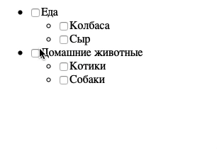
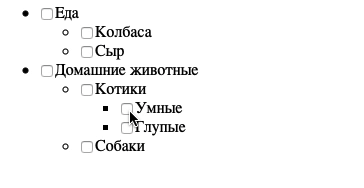

# Дерево интересов

Домашнее задание к занятию 2.2 «Работа с HTML-формами».

## Описание 

Необходимо написать удобное управление списком интересов для профиля пользователя.

### Исходные данные

1. Основная HTML-разметка
2. Базовая CSS-разметка

### Процесс реализации

1. Реализуйте функционал, когда при клике на галочку будут проставляться/сниматься
галочки вложенных списков
2. В этом варианте задаче списки имеют максимум 1 уровень вложенности, поэтому
не нужно делать максимально общее и абстрактное решение.

### Повышенный уровень сложности (не обязательно)

Необходимо добавить функционал:

1. Простановка интересов должна работать на неограниченный уровень вложенности
2. Простановка галочек должна производиться как вниз, так и вверх по дереву
(если выбраны все дочерние элементы, нужно ставить галочку; иначе снимать)
3. Для дочерних элементов, если выбраны не все галочки, у родителя должно
устанавливаться значение *indeterminate*. Про него вы можете узнать более подробно
[тут](https://css-tricks.com/indeterminate-checkboxes/) и 
[тут](https://ruseller.com/lessons.php?rub=28&id=1214)

## Подсказки (спойлеры)

Используемые темы

1. Свойства *checked* и *indeterminate* 
2. Методы *closest*, *querySelector* и *querySelectorAll*
3. [Рекурсия (для повышенной сложности)](https://learn.javascript.ru/recursion)

Советы

В задаче на повышенный уровень сложности довольно легко из-за рекурсии 
переполнить стек вызовов. Внимательно следите за тем, чтобы проверки на наличие
галочек вверх по дереву не шли обратно вниз.

### Процесс реализации

## Решение задач
1. Перейти в папку задания. `cd ./html-forms/interests`.
2. Открыть файл `task.js` в вашем редакторе кода и выполнить задание.
3. Открыть файл `task.html` в вашем браузере и убедиться в правильности выводимых результатов.
4. Добавить файл `task.js` в индекс git с помощью команды `git add %file-path%`, где %file-path% - путь до целевого файла. `git add task.js`.
5. Сделать коммит используя команду `git commit -m '%comment%'`, где %comment% - это произвольный комментарий к вашему коммиту. `git commit -m 'first commit interests'`.
6. Опубликовать код в репозиторий homeworks с помощью команды `git push -u origin master`.
7. Прислать ссылку на репозиторий через личный кабинет на сайте [Нетологии][6].

[0]: https://github.com/
[1]: https://www.sublimetext.com/
[2]: https://code.visualstudio.com/
[3]: https://github.com/netology-code/guides/tree/master/github
[4]: https://git-scm.com/
[5]: https://github.com/netology-code/guides/blob/master/git/REAMDE.md
[6]: https://netology.ru/

*Никаких файлов прикреплять не нужно.*

Все задачи обязательны к выполнению для получения зачета. Присылать на проверку можно каждую задачу по отдельности или все задачи вместе. Во время проверки по частям ваша домашняя работа будет со статусом "На доработке".

Любые вопросы по решению задач задавайте в чате учебной группы.
