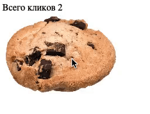
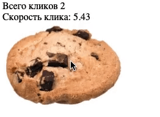

# Игра-кликер

Домашнее задание к занятию 1.1 «Возможности JavaScript в браузере».

## Описание 

Необходимо разработать нового «убийцу времени» - кликер печенек. Всё, что делает игра - 
увеличивает счётчик нажатий на печеньку.

### Исходные данные

Основная HTML-разметка

### Процесс реализации

1. Увеличивайте значение счётчика при каждом клике на печеньку
2. Чередуйте уменьшение и увеличение печеньки при каждом клике (уменьшайте и увеличивайте значения width/height)

### Повышенный уровень сложности (не обязательно)

Добавьте параметр «Скорость клика». Он должен показывать среднее количество
кликов в секунду. Значение обновляется при каждом новом клике.

Например, с момента последнего клика прошло 0.5 секунды. 
Тогда скорость клика = 1/0.5 = 2 клика в секунду

Используйте тип Date для решения этой задачи

## Подсказки (спойлеры)

Используемые темы

1. Событие *click*, метод *onclick*, обработчик события
2. Свойство *textContent*, чтение и запись
3. Работа с атрибутами HTML-тега, *width* и *height*

## Решение задач
1. Перейти в папку задания. `cd ./js-features/cookie-clicker`.
2. Открыть файл `task.js` в вашем редакторе кода и выполнить задание.
3. Открыть файл `task.html` в вашем браузере и убедиться в правильности выводимых результатов.
4. Добавить файл `task.js` в индекс git с помощью команды `git add %file-path%`, где %file-path% - путь до целевого файла. `git add task.js`.
5. Сделать коммит используя команду `git commit -m '%comment%'`, где %comment% - это произвольный комментарий к вашему коммиту. `git commit -m 'first commit cookie-clicker'`.
6. Опубликовать код в репозиторий homeworks с помощью команды `git push -u origin master`.
7. Прислать ссылку на репозиторий через личный кабинет на сайте [Нетологии][6].

[0]: https://github.com/
[1]: https://www.sublimetext.com/
[2]: https://code.visualstudio.com/
[3]: https://github.com/netology-code/guides/tree/master/github
[4]: https://git-scm.com/
[5]: https://github.com/netology-code/guides/blob/master/git/REAMDE.md
[6]: https://netology.ru/

*Никаких файлов прикреплять не нужно.*

Все задачи обязательны к выполнению для получения зачета. Присылать на проверку можно каждую задачу по отдельности или все задачи вместе. Во время проверки по частям ваша домашняя работа будет со статусом "На доработке".

Любые вопросы по решению задач задавайте в чате учебной группы.
