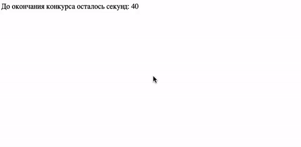
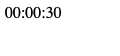

# Таймер обратного отсчёта

Домашнее задание к занятию 1.1 «Возможности JavaScript в браузере».

## Описание 

Для участия в розыгрышах товаров в социальных сетях, требуется разработать таймер
обратного отсчёта. По окончании отсчёта должно всплыть уведомление: «Вы победили в конкурсе».

### Исходные данные

Основная HTML-разметка

### Процесс реализации

1. Прочитайте данные о текущем количестве секунд таймера и запишите их в переменную. 
Это будет стартовое значение таймера
2. Каждую секунду уменьшайте значение таймера на 1
3. По окончании отсчёта выведите сообщение «Вы победили в конкурсе!», используя функцию alert();

### Повышенный уровень сложности #1 (не обязательно)

Реализуйте таймер, отсчитывающий оставшееся время в формате hh:mm:ss
(например, 04:25:19), где *hh* - двухзначное число часов, *mm* - минут, 
*ss* - секунд.

### Повышенный уровень сложности #2 (не обязательно)

По окончании отсчёта времени, запустите загрузку произвольного файла.
Для этого вам потребуются знания объекта *window.location*, который является
частью *BOM*. В курсе мы не будем уделять ему внимание, поэтому
вы можете изучить этот материал самостоятельно:

1. [Window.location](https://developer.mozilla.org/ru/docs/Web/API/Window/location)
2. [Location](https://developer.mozilla.org/ru/docs/Web/API/Location)

__Примечание:__ Обратите внимание, что ссылки (теги *a*) имеют
все свойства объекта Location. Подробнее см. пример
[тут](https://developer.mozilla.org/ru/docs/Web/API/Location)

Для того, чтобы закачка шла, необходимо выполнение одного из условий:

1. Браузер должен перенаправить пользователя на другой адрес
(делается с помощью *window.location*), при этом это не должен быть известный
браузеру файл (вроде pdf, html, jpg), иначе браузер просто откроет этот файл.
2. Можно сделать иначе: поместить невидимый на страницу тег *a* с атрибутом
*download* и *target="_blank"* для старых браузеров 
(\<a href="http://hello.kitty" download target="_blank">), 
поменять ей адрес (атрибут *href*)
и вызвать метод 
[*click()*](https://developer.mozilla.org/ru/docs/Web/API/HTMLElement/click) 
у найденного элемента.

## Решение задач
1. Перейти в папку задания. `cd ./js-features/countdown`.
2. Открыть файл `task.js` в вашем редакторе кода и выполнить задание.
3. Открыть файл `task.html` в вашем браузере и убедиться в правильности выводимых результатов.
4. Добавить файл `task.js` в индекс git с помощью команды `git add %file-path%`, где %file-path% - путь до целевого файла. `git add task.js`.
5. Сделать коммит используя команду `git commit -m '%comment%'`, где %comment% - это произвольный комментарий к вашему коммиту. `git commit -m 'first commit countdown'`.
6. Опубликовать код в репозиторий homeworks с помощью команды `git push -u origin master`.
7. Прислать ссылку на репозиторий через личный кабинет на сайте [Нетологии][6].

[0]: https://github.com/
[1]: https://www.sublimetext.com/
[2]: https://code.visualstudio.com/
[3]: https://github.com/netology-code/guides/tree/master/github
[4]: https://git-scm.com/
[5]: https://github.com/netology-code/guides/blob/master/git/REAMDE.md
[6]: https://netology.ru/

*Никаких файлов прикреплять не нужно.*

Все задачи обязательны к выполнению для получения зачета. Присылать на проверку можно каждую задачу по отдельности или все задачи вместе. Во время проверки по частям ваша домашняя работа будет со статусом "На доработке".

Любые вопросы по решению задач задавайте в чате учебной группы.
