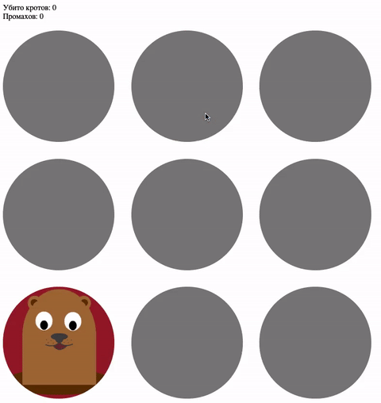

# Игра «Убей кротов»

Домашнее задание к занятию 1.1 «Возможности JavaScript в браузере».

## Описание 

Необходимо дописать игру, убивающую кротов при клике на них. 
В случайной лунке появляется крот. При нажатии на него, 
игроку засчитывается +1 за нажатие. 
Игрок побеждает, если своевременно убивает 10 кротов. 
При 5 поражениях игра заканчивается.



### Исходные данные

Вам требуется __дописать__ уже существующий код, в котором реализовано
появление крота в случайной лунке.

Данный проект включает:

1. Основную HTML-разметку
2. Базовые CSS-классы
3. Часть написанного кода JS

HTML-разметка представляет 9 лунок (класс *hole*), каждая со своим *id*:

```html
<div class="hole-game">
    <div class="hole hole_has-mole" id="hole1"></div>
    <div class="hole" id="hole2"></div>
    <div class="hole" id="hole3"></div>
    <div class="hole" id="hole4"></div>
    <div class="hole" id="hole5"></div>
    <div class="hole" id="hole6"></div>
    <div class="hole" id="hole7"></div>
    <div class="hole" id="hole8"></div>
    <div class="hole" id="hole9"></div>
</div>
```

__Условия победы и поражения__

Случайным образом у одной из лунок добавляется класс *hole_has-mole*, что
значит, что в лунке есть крот.

Только если при клике на лунку с классом *hole_has-mole* вы должны засчитать +1
к победе. В ином случае - поражение.


### Процесс реализации

1. Используя цикл зарегистрируйте для каждой лунки обработчик событий
2. Проверьте наличие нужного класса и увеличьте значение нужного счетчика
3. По выигрышу или проигрышу обнулите статистику

_Чтобы не создавать для каждой лунки отдельную переменную,
напишите функцию *getHole( index )*, которая по индексу будет
возвращать нужный элемент. Обратите внимание, что идентификаторы
лунок располагают для такого подхода. Пример реализации можно посмотреть в файле base.js._

## Подсказки (спойлеры)

<details>
<summary>Используемые темы</summary>

1. Функция *alert*
2. Событие *click*, метод *onclick*, обработчик события
3. Свойство *textContent*, чтение и запись

</details>

<details>
<summary>Советы</summary>

1. Используйте цикл для задания обработчика для каждой лунки.
2. Для проверки на наличие того или иного класса, используйте метод
[includes](https://developer.mozilla.org/ru/docs/Web/JavaScript/Reference/Global_Objects/String/includes):

```javascript
hole.className.includes( 'hole_has-mole' );
```

Более удобный вариант - использовать объект 
[*classList*](https://developer.mozilla.org/ru/docs/Web/API/Element/classList), 
с которым вы познакомитесь позднее. Он содержит удобный метод *contains*:

```javascript
hole.classList.contains( 'hole_has-mole' );
```


</details>

## Решение задач
1. Перейти в папку задания. `cd ./js-features/mole-game`.
2. Открыть файл `task.js` в вашем редакторе кода и выполнить задание.
3. Открыть файл `task.html` в вашем браузере и убедиться в правильности выводимых результатов.
4. Добавить файл `task.js` в индекс git с помощью команды `git add %file-path%`, где %file-path% - путь до целевого файла. `git add task.js`.
5. Сделать коммит используя команду `git commit -m '%comment%'`, где %comment% - это произвольный комментарий к вашему коммиту. `git commit -m 'first commit mole-game'`.
6. Опубликовать код в репозиторий homeworks с помощью команды `git push -u origin master`.
7. Прислать ссылку на репозиторий через личный кабинет на сайте [Нетологии][6].

[0]: https://github.com/
[1]: https://www.sublimetext.com/
[2]: https://code.visualstudio.com/
[3]: https://github.com/netology-code/guides/tree/master/github
[4]: https://git-scm.com/
[5]: https://github.com/netology-code/guides/blob/master/git/REAMDE.md
[6]: https://netology.ru/

*Никаких файлов прикреплять не нужно.*

Все задачи обязательны к выполнению для получения зачета. Присылать на проверку можно каждую задачу по отдельности или все задачи вместе. Во время проверки по частям ваша домашняя работа будет со статусом "На доработке".

Любые вопросы по решению задач задавайте в чате учебной группы.
